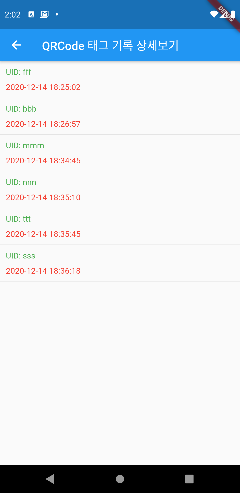

# Flutter QR Code Scanner

# Generate your own qr code

# Scan QR Code
[!][Scanner Demo](screenshot/scan_demo.gif)

# View All QR Code

# Check Tag Record

# TODO
Add Login Function and manage by user

### Feel Free to use this code and develop