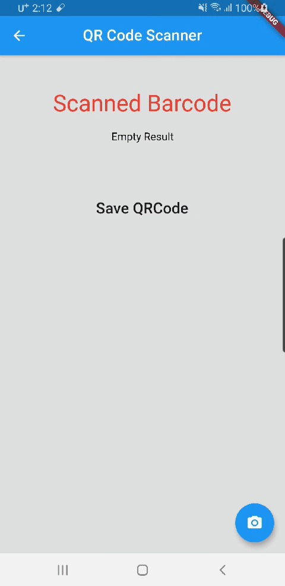

# Flutter QR Code Scanner

# Generate your own qr code
<image src="screenshot/generate_qr_code.png" width="50%">

# Scan QR Code

# View All QR Code
<image src="screenshot/view_all.png" width="50%">

# Check Tag Record

<image src="screenshot/view_detail.png" width="50%">

# TODO
Add Login Function and manage by user

### Feel Free to use this code and develop
